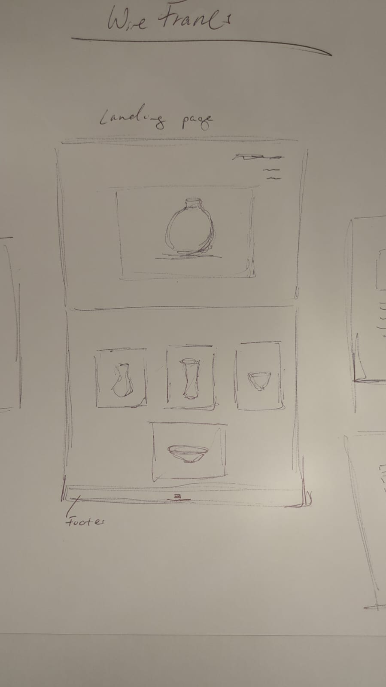
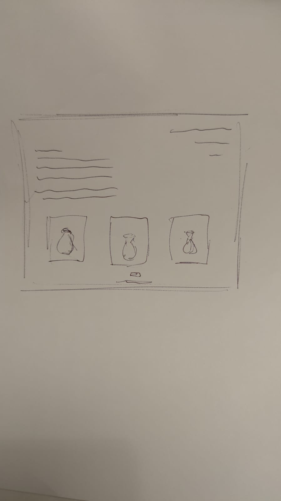

A complete website for the fine art ceramicist Daniel Harman. To increase awareness of the artists current work and his up-and-coming exhibitions. 

### Daniel Harman Artist Portfolio

#### User Experiences
User One - I would want the profile picture on the first page and then pictures of his work following, to get a faster vibe of the artist and work this way. I liked seeing the projects grouped on the first page. Easy style and aesthetics of the website. 
User Two- I enjoyed the colours of the site, the website flows nicely. 

#### Strategy 
The aim of the website is to showcase the artists portfolio, furthermore, to provide a contact space for acquisition of artists’ work. 

#### Scope – Function
The site must be clear, and the images and work well define, to differentiate between the projects.
The site must be minimalist to not distract from the images of artists work. 

#### Scope – Content 
The ideal customer visiting the website would consist of galleries, private buyers as well as small boutique businesses. Private buyers would be from affluent social economical backgrounds. 
where? 

Visitors to the site would also include curators as well as students. 
Clearly illustrate who the artist is, inform the site visitor of the artists current exhibitions and the future exhibitions. 

#### Structure 

* A navigation bar
* A clearly defined homepage depicting anchored images of the artists different projects. 
* A selection of the artists projects on individual pages. 
* An About Page for the artist to be introduced. 
* A Contact Page for perspective buyers, exhibitors, curators, and individuals with a general interest in the artist work.  

#### Skeleton 

 

 

 

![frame] (./Readme-media/full-frame.jpg)

 

#### Surface 
Aesthetically for the site I decided that a minimalist feel would be most appropriate for the artists portfolio. Wanting it to have a sleek and clean design, I wanted a simple floating navigation bar as well as opting for the artists name- Daniel Harman, to serve as the link to the landing page. 
It was essential that high quality images that were not warped and are of an adequate size to depict the details within the work were used for the site. 
I utilized Colorhunt.co to find a colour palette for the site, wanting the site to have a  warming aesthetic whilst requiring a neutrality so as not to take away from the images of the artists work. 

#### Features 
Navigation Bar essential for each page, consistent in style, layout and size. The navigation bar linking the user back to the landing page through the artists name, negating the need to make use of the back button. 
The main landing image, introducing the artist style. Followed by a gallery selection of images to demonstrate the artists range. This further extending the range of the visitors scope from the variety of choice.  
Exhibition section on the About Page, bring a the history and future of the artist, whilst including a photograph of the artists, Daniel Harman to fully introduce him to the viewer. 
The footer section, inclusive of a social media link, to explore the artists work during it’s development. 
A Contact Page, containing a contact form, with the text area input set to required so that additional information for the visitors’ inquiries are essential. 

#### Possible Future Features 
-	A artwork purchasing page work on the website.
-	Developing a logo in future.
-	Expanding the social media links and presence. 

 
#### Technologies

- Visual Studio Code 
- Github 
- Git
- HTML 
- CSS 
- Bootstrap V5.3.x 
- W3C HTML & CSS validator.  
- Tinypng.com 
- Beautifier. 
- Unsplash.com
- Pexels.com
- imagecompressor.com
- ChatGPT
- Colorhunt.co
- Dev Tools

#### Testing 
The site was put through W3C HTML & CSS validator.   
I acquired user testing for the site. 
The site was tested on various screen sizes through Dev Tools to ensure website responsiveness across a variety of .   

#### Manual Testing
- Testing the anchored images on the landing page of the site to 
- I tested that the social media button works and takes you to a new window
- I tested that the contact form submit button worked, resulting in the information being sent to the code institute form dump. 
- Testing that the additional information was required within the form. 
- Clicking the links in the navigation will take you to the correct pages.
- Checking the navigation works on all pages.
- Checking the images are not stretched or pixelated larger screens. 

#### Bugs and Fixes
A issue that I encountered was  the renaming of my files in keeping with industry standard.  Requiring a change in my git config settings to stop being case insensitive as it was preventing the renaming of the files.
In running the site code through the validator, it illustrated several issues with my code. Mainly being the issues with regards to my file paths, from the use of invalid characters. I was able to fix this and restore the images to the code. I unfortunately found several floating 
 tags within the code, I was able to locate and fix.
My site did not pass the css validation initially, due to a value error. I corrected the issue and my css passed the validation. 

Another bug that I encountered was the body container hugging the left of the screen on the index page and the project-three-page. I was able to find that on the index page I had implemented the container class in the wrong tag and on project-three-page I had not included the container class which would fix the layout issue to centralise the page body. 

  

#### Deployment
Using Visual Studio Code to write my code. I created a GitHub repository, going on to clone it locally, developing it locally, committing and pushing to the remote repository.  Going on to deploy my site to GitHub, by following the guidance document. 

#### Browser Compatibility
I have tested my site on the following: 
-	Firefox and Microsoft edge (desktop only)
-	Chrome (desktop and mobile)

#### Credits
The general text of the website was generated through ChatGPT. 
The Instagram icon in the footer was generated through Bootstrap.  I also utilized Bootstrap for grid layout and responsive design. 
The media from the site were taken from Unsplash.com and pexels.com. With the images being compressed using tinypng.com and imagecompressor.com. 
Colorhunt.co to choose a colour palette. 
My mentor provided me with the ‘https://formdump.codeinstitute.net’ for my form to be actioned too. 
www.w3schools.com and developer.mozilla.org/en-US/ for referencing. 

